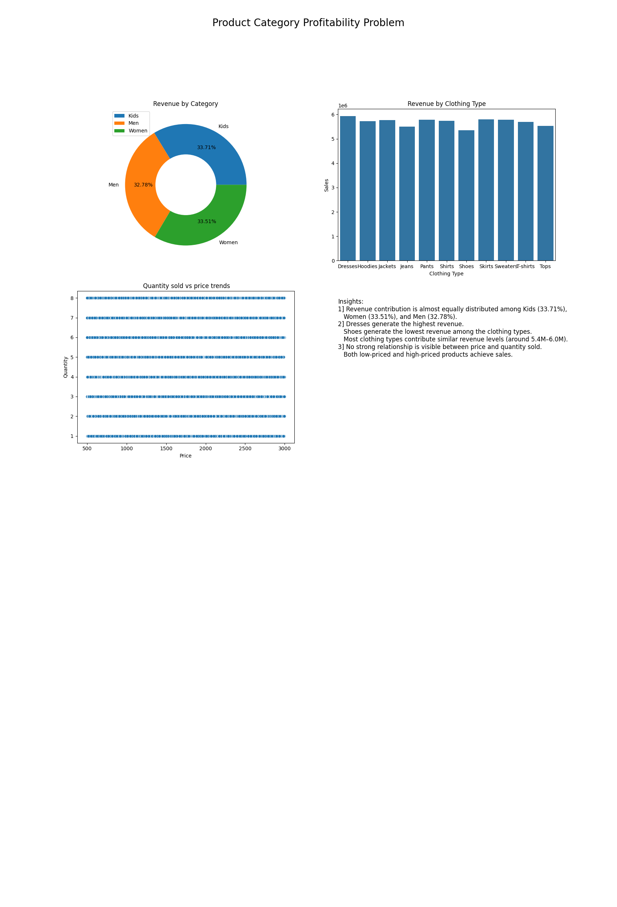
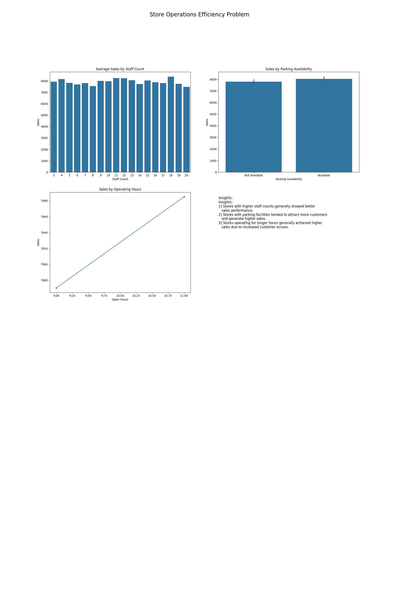
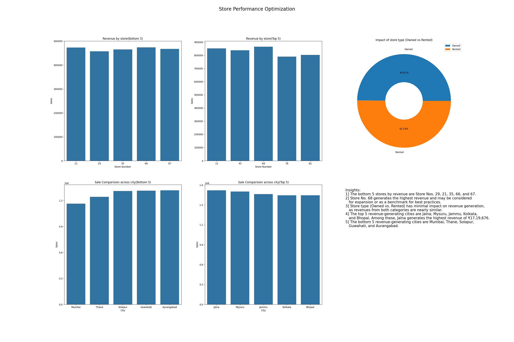

# Zudio Sales Analysis

## Project Overview

This project analyzes Zudio sales data using Python to identify revenue trends, customer behavior, and factors affecting store performance. The analysis includes data cleaning, exploratory data analysis (EDA), visualization, and business insights generation.

## Tools Used

* Python
* Pandas
* NumPy
* Matplotlib
* Seaborn
* Jupyter Notebook

## Key Objectives

* Analyze sales performance across product categories
* Compare revenue contribution by category
* Study the impact of staff count on sales
* Evaluate store characteristics affecting performance
* Identify business opportunities for revenue growth

## Key Insights

* Product categories contributed differently to overall revenue.
* Staff count showed a measurable relationship with sales performance.
* Store features such as parking availability influenced customer engagement.
* Revenue trends highlighted opportunities for operational improvements.

## Project Structure

* `ETL and EDA.ipynb` – Data cleaning and exploratory analysis
* `README.md` – Project documentation
* Dashboard images – Business insights and visualizations

## Dashboards

### Product Category Profitability Dashboard

### Sales Trend & Seasonality Analysis Dashboard

### Store Operations Efficiency Dashboard

### Store Performance Optimization Dashboard

## Author

Anushka Thorat

Aspiring Data Analyst | Python | SQL | Data Visualization | Business Analytics

